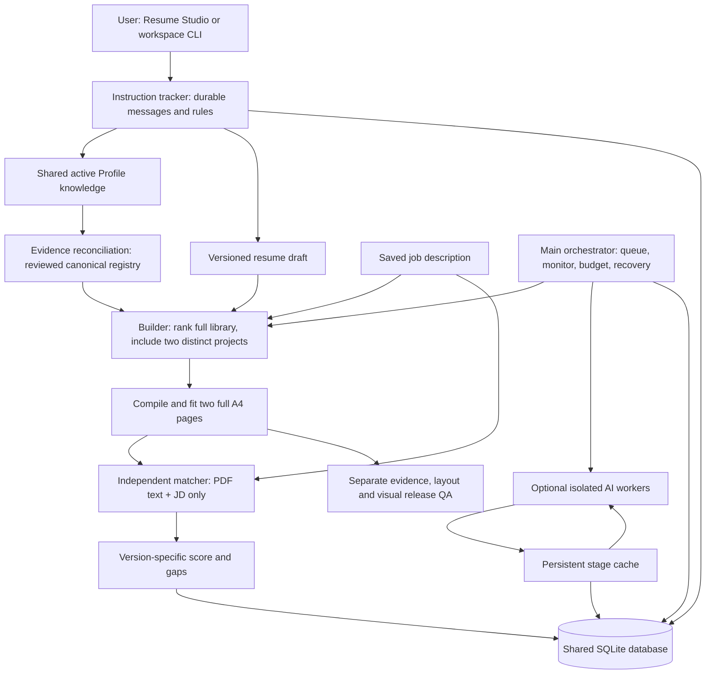

# Career agent system: architecture and end-to-end workflow

Updated 15 September 2026. This document describes the implemented local application, including its limits. Start it with `Start Dashboard.command` in the workspace root, then open Resume Studio and select an exact saved job.

## What the system does

The main orchestrator coordinates small workers and records their progress. Routine work uses Python rules: saving instructions, tracking edits, ranking projects, fitting PDFs, scoring document vocabulary and monitoring runs. Optional AI is reserved for public research, contextual instruction interpretation, qualitative document review, discovery and email interpretation. Completed AI stages are retained and reused.

All mutable state lives in **`career-dashboard/data/career.db`**. The UI and chat CLI share `Workspace` and `CareerServices`. There is no second job/status database. Generated files are stored once under each application's `studio/` folder. The existing daily automation is unchanged.

The current candidate revision is **2026-09-13.1**. July 2025 is the confirmed Associate Analyst end date. The summary may say **3+ years of combined professional and internship experience**. Additional internship dates/employers are unspecified; the system must not manufacture them. MSc award status remains in progress. See `context/sources/2026-09-13-correction.md` and registry IDs `EXP-INFOCEPTS-001` / `EXP-TOTAL-001`.

## Architecture at a glance



## Workers and boundaries

| Worker | Inputs | Result | AI cost |
|---|---|---|---|
| Main orchestrator | Job ID, draft revision, worker states | Queued/running/completed/failed run with progress | None |
| Instruction tracker | User messages, selected draft | Applied edit, pending profile fact, clarification or error, all retained | None |
| Optional instruction interpreter | Last 12 relevant chat messages, current editable fields, project choices | Suggested supported commands and questions; user can put a suggestion into the chat | One cached call |
| Profile tracker | User-added skills, either project's fields, profile notes | Deduplicated active knowledge and activity events | None |
| Project ranker / builder | Saved JD, reviewed registry, active project availability | Two distinct ranked project slots and evidence-linked draft | None |
| Layout fitter | Saved source, readable font setting | Measured two-page PDF and page previews | None |
| Document matcher | Actual current PDF text and saved JD | Explainable term-coverage score, excerpts and missing vocabulary | None |
| Optional document reviewer | Actual current PDF text and saved JD only | Qualitative strengths, partial matches, gaps and recommendations | One cached call |
| Public company researcher | Allow-listed company/title/location/URL/JD | Dated public research and sources | One cached call |
| Independent hiring manager | JD and public research only | Employer expectations | One cached call |
| Resume advisor | JD and public research only | Resume priorities and proposed project ideas | One cached call after research |
| Profile comparison | Active knowledge, JD, research, independent hiring review | Candidate strengths and gaps | One cached call after research/hiring |
| Discovery / email reviewer | Existing scoped discovery/mail inputs | Verified postings / interpreted email evidence | Live calls, budgeted, not cached |
| Release validator | Source, registry, evidence map, PDF, current previews | Hard pass/fail gates | None |

AI workers run in fresh single-turn processes in temporary directories on the selected runtime, with shell tools disabled. Public and document workers have apps disabled. Codex and Claude are both supported and are chosen in Agent control; see [AI-RUNTIMES.md](AI-RUNTIMES.md). The existing email worker exposes only its allowed Gmail read tools and always runs on Codex, the only runtime with connected mailbox tools. The hiring manager receives no profile, chat, notes, email or workspace files. The independent document scorer is a pure function in `services/resume_match.py`; even the optional qualitative reviewer receives only the document/JD payload.

## How to use the workflow

1. Save a full job description with its exact posting URL. Select that job in Resume Studio. Opening a draft spends no AI calls.
2. The draft includes two distinct projects selected from the full ranked library. All active projects remain visible in the library; edited/unreviewed projects are labelled and unavailable for automatic selection until reconciled. Existing project slots can be changed individually.
3. For an older draft, select **Sync profile & rank 2 projects**. This saves a new version, applies the reviewed July 2025/combined-experience correction where recognizable, refreshes both ranked project slots and stamps the current profile revision. Original packs and earlier versions are preserved. Custom unrelated wording is retained for review.
4. Use the instruction chat or direct editor. Save direct editor changes before sending chat edits. Every chat message has a durable outcome, including unrecognized requests and stale-version conflicts.
5. Select **Build & score · free**. The orchestrator captures the requested revision, checks evidence readiness, fits the saved content at 10–12pt, compiles with Tectonic, renders the actual pages, checks page usage, and scores the resulting PDF against the JD. Progress and failures appear in Agent control.
6. Read the score's matching PDF excerpts and gaps. Optionally request **AI document review** for qualitative interpretation. It receives only the finished document and JD. Re-run after edits; the review remains labelled with its source version.
7. Complete role eligibility, requirement/evidence mapping and visual review before release. A successfully built/scored draft is not automatically released and never marks an application as submitted.

### Instruction examples

| Message | Effect |
|---|---|
| `summary: My exact professional summary…` | Replaces this draft's summary, with LaTeX escaping |
| `skills: SQL; Power BI; Python` | Replaces core skills; new terms are captured for evidence review |
| `project: PROJ-AZ-RECON` | Changes the first slot to an active registered project |
| `second project: PROJ-POWERBI-PORTFOLIO` | Changes the second slot; duplicate projects are rejected |
| `font: 11` | Saves 11pt body type and remembers that preference for this job |
| `experience: Role, employer, dates and my correction…` | Saves a global Profile experience note for reconciliation |
| `note: A factual detail I want to retain…` | Saves a global Profile fact for reconciliation |
| `help` | Shows the supported grammar |
| Any other free text | Retains the full request with a clarification state |

For free text outside the grammar, **Understand free text · optional AI** considers recent conversation and the current draft. It returns suggested supported commands. Selecting **Use suggested command** puts one in the input for review; sending it follows the same rules and revision checks. AI interpretation does not silently rewrite claims. This is deliberately an honest distinction between listening (always stored), interpreting and actually applying a change.

Formatting and content instructions are scoped to the selected job. Profile notes are global. Deleting a Profile entry excludes it from future selection; restoring a resume version does not resurrect deleted knowledge. Directly editing either project captures user-supplied facts, not new verified evidence.

## Two projects and two full pages

The registry holds the complete project library. The deterministic ordering uses word overlap with the saved JD and stable ID tie-breaking. The library shows rank and eligibility; this is an ordering aid, not a semantic hiring score. Public research may inform a human/AI review of the ranking, but cannot add candidate experience.

The first slot retains compatibility names `SelectedProject…`; the second uses `SecondProject…`. Both carry evidence comments, separate rendered blocks and 2–3 approved bullets. `selected_project_ids` in new evidence maps records both IDs; the old singular key remains the first-slot compatibility field.

The fitter ranks relevant existing experience and skills, expands only approved supporting facts and measures actual rendered ink. Acceptance requires exactly two A4 pages, normal margins, at least 92% content-height usage per page, bounded bottom whitespace and internal gaps, and readable 10–12pt body type. It never shrinks below 10pt. A requested fixed font is honored; if the content cannot fit at that size, the run fails and preserves the previous version. Send `font: auto` to restore automatic font fitting, or choose another supported size and retry.

The generic base template is a two-page starting document. **Build & score / Fill two pages** is the measured full-page operation for a specific JD. Arbitrarily long custom text may require an edit; the system reports that instead of adding filler or silently omitting a project. Source, PDF and page images belong to the same saved revision.

## Matching score: what it means

The default **JD term coverage** score is `100 × matched weight / detected weight`. The detector uses an explicit analytics vocabulary and aliases. A term mentioned only in preferred/desirable sentences weighs 1; other detected terms weigh 2. Each matched term includes the JD excerpt and PDF line. No detected vocabulary produces “Not scored,” rather than a misleading zero or perfect score.

Vocabulary presence does not establish proficiency, satisfy negated requirements, prove years of experience, or assess work rights. Unknown vocabulary is outside coverage. This is **not an ATS score or hiring probability**. The separate optional AI reviewer can explain semantic partial matches and gaps. Supported requirement coverage in an evidence map and binary artifact QA remain separate assessments.

Scores store revision, source hash, PDF hash and JD hash. Editing the source or JD makes the old score stale. The scorer will not use an old preview for a changed draft. Repeated scoring of the same document/JD reuses the stored score.

## Saving AI credits

- Default local limit: **6 AI invocations per Dublin calendar day**, editable from 0 to 50 in Agent control. Set 0 to use free workers and existing cached results only.
- The limit counts invocation attempts, including failed calls. It is not a measurement of account credits or token consumption. Other tasks you run in Codex or Claude yourself are outside this local budget.
- Cache lookup happens before budget reservation. Identical inputs can be reused even when the daily budget is exhausted.
- Cache keys include worker version, full prompt/input context, output schema, invocation options and, for every runtime other than Codex, the runtime itself. Changes in JD, profile context, instructions or playbook text cause misses, and switching runtime neither reuses nor discards another runtime's saved result.
- Web research expires after seven days. Offline results persist until their inputs/schema/version change. Reuse retains original source dates; it is not represented as fresh research.
- Company research is shared by research/hiring and resume-advisor flows. A failed later stage does not discard successful cached earlier stages.
- Discovery and email calls remain live because their underlying state changes; their results still live in run/mail/job history.
- Only one orchestrator worker executes at a time. Same-kind active runs for the same job are deduplicated. AI budget reservations use a SQLite write transaction before invoking the runtime.
- There is no automatic AI retry loop. Interrupted queued/running runs become failed on app restart and can be retried explicitly. The saved stages support inexpensive continuation.

## Storage and implementation map

| Location | Owns |
|---|---|
| `services/agents.py` | Orchestrator queue, isolated workers, partial progress, recovery, existing mail schedule, unchanged Codex call |
| `services/ai_runtime.py` | Runtime registry, Codex/Claude selection, capability routing and worker isolation |
| `services/agent_cache.py` | AI cache, invocation ledger and daily budget |
| `services/instruction_tracker.py` | Chat grammar, message idempotency and durable outcomes |
| `services/workspace_v2.py` | Shared Profile, goals, email, preferences and worker registry |
| `services/resume_projects.py` | Two evidence-linked project slots |
| `services/resume_studio.py` | Draft versions, both-slot capture, profile sync, PDF compilation, score provenance |
| `services/resume_layout.py` | Relevance ordering, typography and actual page measurements |
| `services/resume_match.py` | Independent, profile-free scoring function |
| `dashboard/api_v2.py` | Loopback API routes and request validation |
| `frontend/src/features/AgentControl.tsx` | Chat, budget, optional AI actions and all-agent monitor |
| `frontend/src/features/ResumeStudio.tsx` | Draft editor, project library, PDF preview and score |
| `scripts/validate_resume.py` / `validate_batch.py` | Two-project evidence and release checks |

SQLite tables include existing `jobs`, `knowledge`, `agent_runs`, `preferences`, `studio_drafts`, `studio_versions`, `studio_captures` and activity events, plus:

- `instruction_messages`: original text, reply, job scope, outcome, timestamp and unique request ID.
- `ai_cache`: input hash, JSON output, creation date, web flag and cache-hit count.
- `ai_calls`: reservation ID, cache key, local day, state, timestamp and failure detail.
- `resume_scores`: exact job/revision/source/PDF/JD identity and full JSON result.

Database creation is additive. Keep backups of the SQLite database and application folders together. Readable JSON/Markdown exports are projections, never alternate authorities. Never rewrite the preserved historical-pack manifests.

## API and CLI

Important endpoints under `/api/v2`:

- `GET /agent-control`, `PUT /agent-control/budget`
- `GET /instructions?job_id=ID`, `POST /instructions`
- `POST /agents/run` with `resume_build`, `resume_match`, `instruction_interpret`, or an existing worker kind
- `POST /studio/ID/sync-profile`, `/fill`, `/preview`, `/score`
- Existing Studio open/get/save, Profile and job APIs remain available.

From the workspace root:

```sh
career-dashboard/.venv/bin/python career-dashboard/scripts/workspace.py agent-control
career-dashboard/.venv/bin/python career-dashboard/scripts/workspace.py instructions --job-id EXACT_ID
career-dashboard/.venv/bin/python career-dashboard/scripts/workspace.py send-instruction --job-id EXACT_ID --revision 3 --message 'font: 11'
career-dashboard/.venv/bin/python career-dashboard/scripts/workspace.py run --kind resume_build --job-id EXACT_ID
career-dashboard/.venv/bin/python career-dashboard/scripts/workspace.py score --job-id EXACT_ID
```

Pass the current revision, not the example number. The API rejects stale saves and retains chat conflicts. The server remains loopback-only, rejects foreign browser origins and constrains output-file paths.

## Verification and practical limits

Run `./Check Workspace.command` after changes. Tests use disposable workspaces and mock optional AI; real PDF tests compile and render locally. AI availability still depends on an installed, signed-in runtime; Agent control reports which one is active and what is missing. No paid live AI calls are necessary to test the deterministic workflow or cache contracts.

Current deliberate limits: the rule grammar is finite; optional AI suggestions require sending a supported command; full-page fitting can fail for unsuitable custom content; historical drafts require explicit profile sync; role eligibility and visual release approval are separate. Monitoring is local to this app's workers, not every task you run in Codex or Claude yourself. No application submission, outreach or extra automation is part of this architecture.
